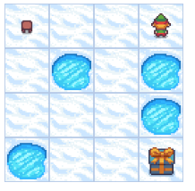
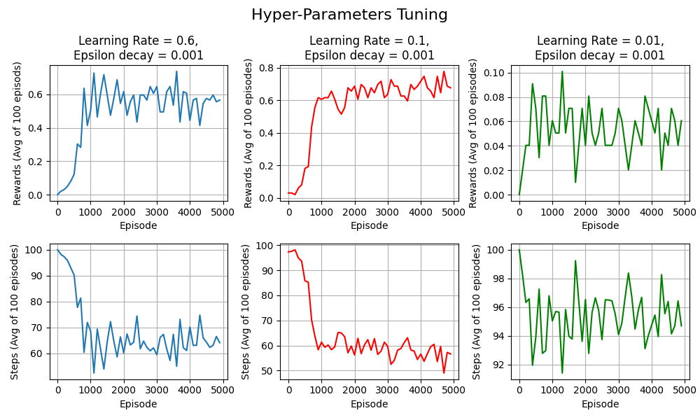
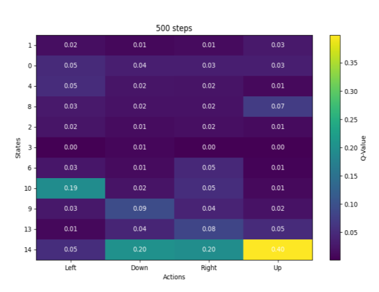
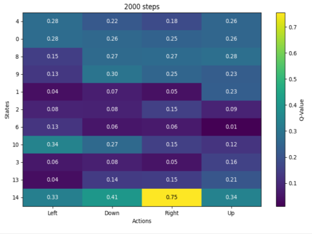
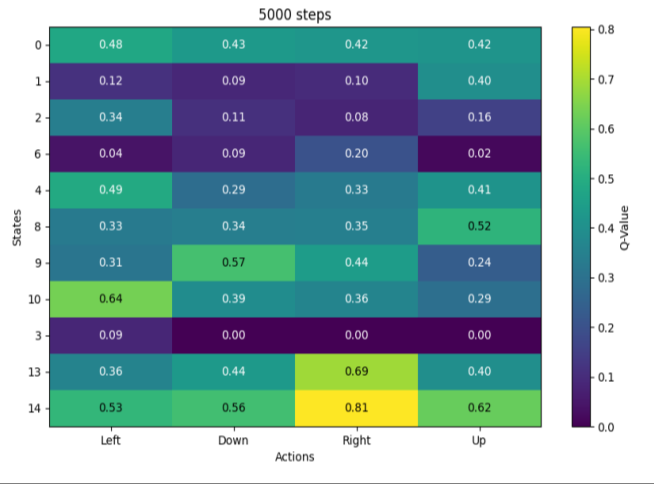
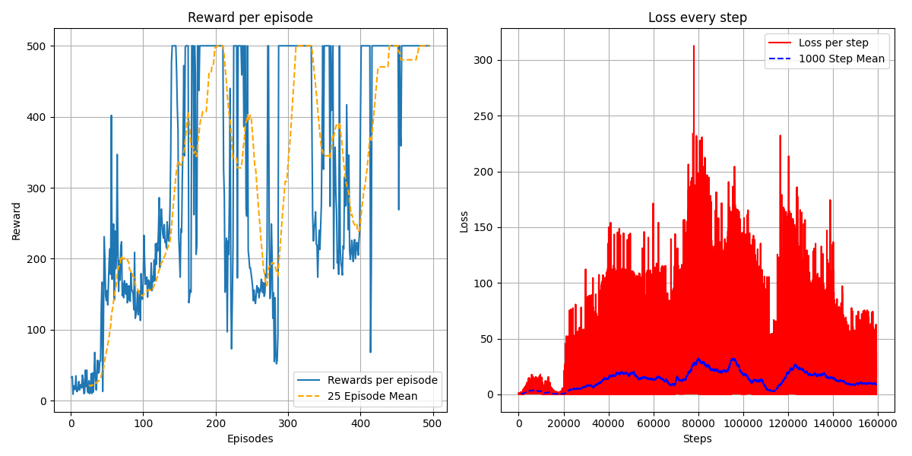
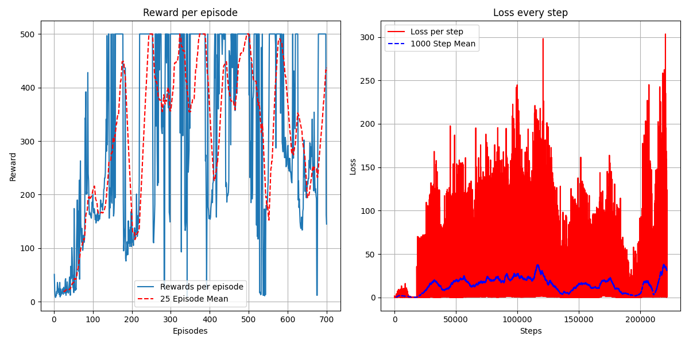
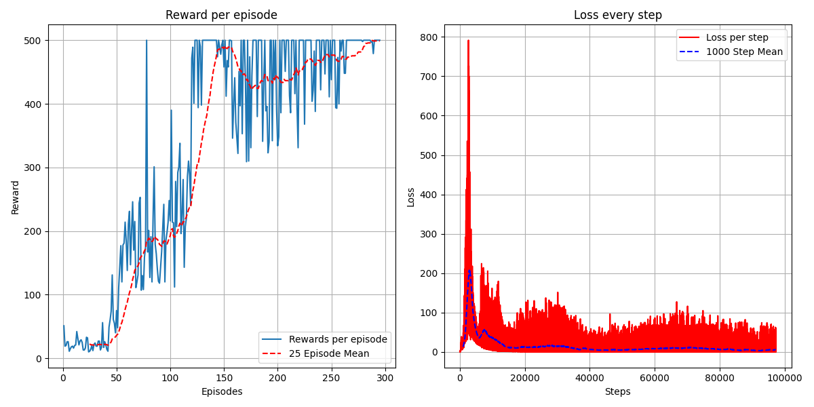

# Deep Reinforcement Learning: Q-Learning

---

## Overview

This project implements and compares three reinforcement learning algorithms:

1. **Tabular Q-Learning** on the FrozenLake-v1 environment
2. **Deep Q-Network (DQN)** on the CartPole-v1 environment (3-layer and 5-layer variants)
3. **Double DQN** on the CartPole-v1 environment

---

## Section 1 - Tabular Q-Learning

### Theoretical Questions

- **Q1 - Why can't Value Iteration be used for environments with unknown dynamics?**
  Value Iteration is a model-based method that requires full knowledge of the environment's dynamics to determine the optimal solution. It also assumes a finite set of states and actions. For environments with unknown or complicated dynamics, these assumptions do not hold, making Value Iteration inapplicable.

- **Q2 - What are model-free methods?**
  Model-free methods do not require knowledge of the environment's dynamics. Instead, they learn directly from interacting with the environment through trial and error to estimate the value of states or state-action pairs.

- **Q3 - SARSA vs. Q-Learning**
  SARSA is an on-policy method that updates the Q-value based on the actual action taken in the next state following the current policy. Q-Learning is an off-policy method that updates the Q-value using the maximum possible future reward, assuming optimal actions. Q-Learning often converges faster but may disregard exploratory actions, unlike SARSA.

- **Q4 - Why use a decaying epsilon-greedy strategy instead of acting greedily?**
  Acting greedily prioritizes short-term rewards but risks getting stuck in suboptimal routines. A decaying epsilon-greedy strategy balances exploration and exploitation by encouraging more exploration early in learning and gradually shifting towards greedy actions as the agent gains confidence.

### Implementation

A Q-Learning agent was implemented for the **FrozenLake-v1** environment (4x4 grid, slippery). A lookup table of Q-values for each state-action pair (16 states x 4 actions = 64 entries) was initialized to zero.

<p align="center">
  
  <br><em>Figure 3: The FrozenLake 4x4 environment</em>
</p>

**Best hyperparameters found:**

| Parameter | Value |
|---|---|
| Learning Rate | 0.1 |
| Epsilon Decay | 0.001 |
| Discount Factor | 0.99 |
| Initial Epsilon | 0.8 |
| Final Epsilon | 0.01 |

Hyperparameter tuning was performed by testing multiple combinations. The figure below shows an example of tuning over the learning rate:

<p align="center">
  
  <br><em>Figure 1: Hyperparameter tuning for the Q-Learning agent</em>
</p>

The Q-value lookup table was tracked at different stages of training (500, 2500, and 5000 episodes):

<p align="center">
  
  
  
  <br><em>Figure 2: Q-value lookup table at 500, 2500, and 5000 episodes</em>
</p>

**Key observations:**
- After 500 steps, most Q-values remained at 0 due to the low probability of reaching the goal state by chance
- State 14 had the highest Q-values since it is the only state allowing a direct transition to the goal
- State 3 had zero Q-values due to being surrounded by many holes
- The algorithm works but is not optimal: the shortest path is 7 steps, yet the agent typically requires ~50 steps

---

## Section 2 - Deep Q-Network (DQN)

### Theoretical Questions

- **Q1 - Why sample experiences in random order?**
  Random sampling from the experience replay buffer breaks the correlation between consecutive state-action pairs. This reduces variance caused by such correlations, leading to more stable and effective training.

- **Q2 - Why use an older set of weights (target network) to compute targets?**
  Using an older set of weights stabilizes training by preventing target values from changing too rapidly, which can cause instability and divergence. Updating the target network every C steps provides a consistent reference for computing the loss, allowing the model to converge more reliably.

### DQN Agent - 3 Hidden Layers

**Architecture:** Input(4) -> 64 -> 64 -> 16 -> Output(2)

**Hyperparameters:**

| Parameter | Value |
|---|---|
| Learning Rate | 0.0005 (Adam) |
| Batch Size | 256 |
| Epsilon Decay | 0.9995 |
| Discount Factor | 0.99 |
| Initial Epsilon | 1.0 |
| Final Epsilon | 0.005 |
| Replay Buffer Capacity | 10,000 |
| Target Network Update (C) | Every 100 steps |
| Max Steps per Episode (T) | 500 |
| Max Episodes | 600 |
| Stopping Criterion | Avg reward >= 475.0 over 100 consecutive episodes |

**Results:**
- The model successfully converged after a few hundred episodes, achieving an average reward exceeding 475
- On average, ~350 episodes were needed to reach the reward threshold
- The loss curve shows initial decrease followed by periodic spikes when the target network is updated

<p align="center">
  
  <br><em>Figure 4: Results for the DQN agent with 3 hidden layers — reward per episode (left) and loss per step (right)</em>
</p>

### DQN Agent - 5 Hidden Layers

**Architecture:** Input(4) -> 64 -> 64 -> 32 -> 32 -> 16 -> Output(2)

Same hyperparameters as the 3-layer network.

**Results:**
- The extended network did not provide significant improvement and performed worse than the simpler network
- The additional layers likely introduced noise during optimization or caused overfitting
- The 3-layer network is sufficient to approximate the Q-function for this relatively simple problem

<p align="center">
  
  <br><em>Figure 5: Results for the DQN agent with 5 hidden layers</em>
</p>

---

## Section 3 - Double DQN (Improved DQN)

### Algorithm

Double DQN uses two separate Q-networks to alternate the roles of action selection and action evaluation. This reduces the overestimation bias of Q-values inherent in standard DQN. Instead of using the same network for both tasks, Double DQN leverages two networks to perform these roles separately.

The same 3-hidden-layer architecture was used for fair comparison with the standard DQN.

### Results

- Achieved the goal of avg reward >= 475.0 over 100 consecutive episodes in **fewer than 300 episodes** (vs. ~350 for standard DQN)
- The average loss per step was much more stable with lower values compared to the standard DQN
- Same network architecture and hyperparameters were used, strongly indicating an algorithmic improvement

<p align="center">
  
  <br><em>Figure 6: Results for the Double DQN — reward per episode (left) and loss per step (right)</em>
</p>

---

## Project Structure

```
.
├── Qlearning.py          # Tabular Q-Learning agent for FrozenLake-v1
├── DQN.py                # DQN agent (3-layer and 5-layer) for CartPole-v1
├── DoubleDQN.py          # Double DQN agent for CartPole-v1
├── images/               # Figures from the report
├── Assignment1_Report.pdf # Full assignment report
├── requirements.txt      # Python dependencies
└── README.md             # This file
```

## Setup & Usage

### Prerequisites

- Python 3.10+

### Installation

```bash
python -m venv venv
source venv/Scripts/activate   # Windows (Git Bash)
# or: source venv/bin/activate # Linux/Mac
pip install -r requirements.txt
```

### Running the Scripts

```bash
# Section 1 - Tabular Q-Learning on FrozenLake
python Qlearning.py

# Section 2 - DQN on CartPole
python DQN.py

# Section 3 - Double DQN on CartPole
python DoubleDQN.py
```
